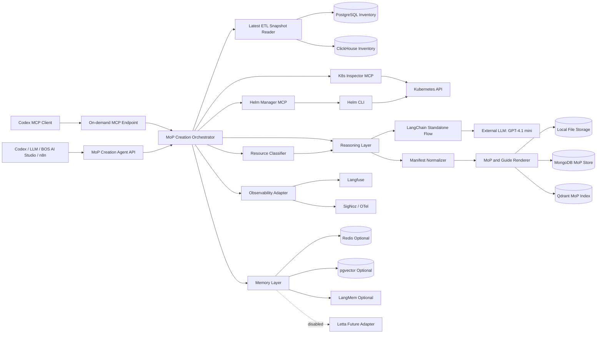
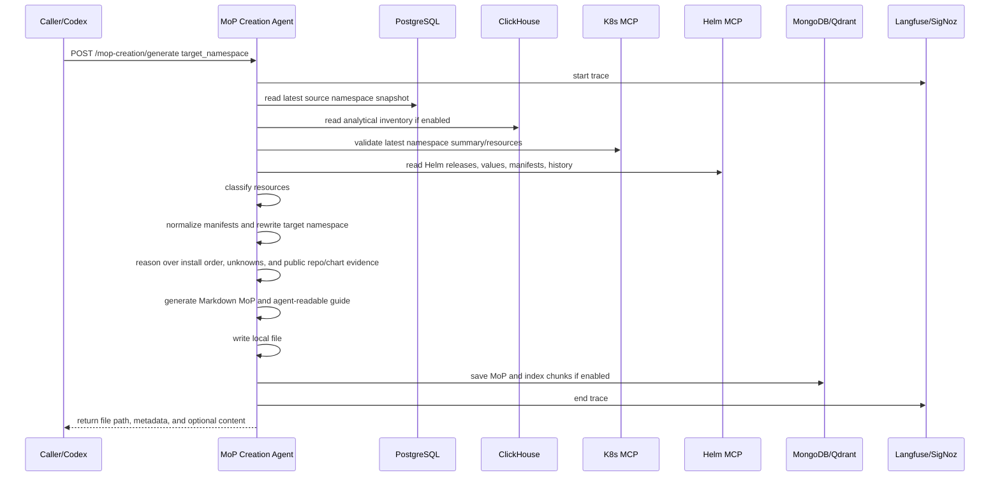
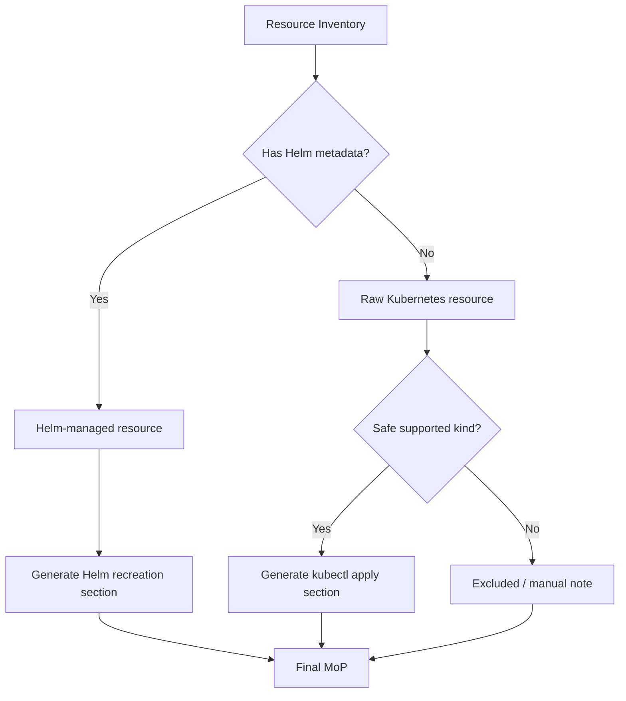
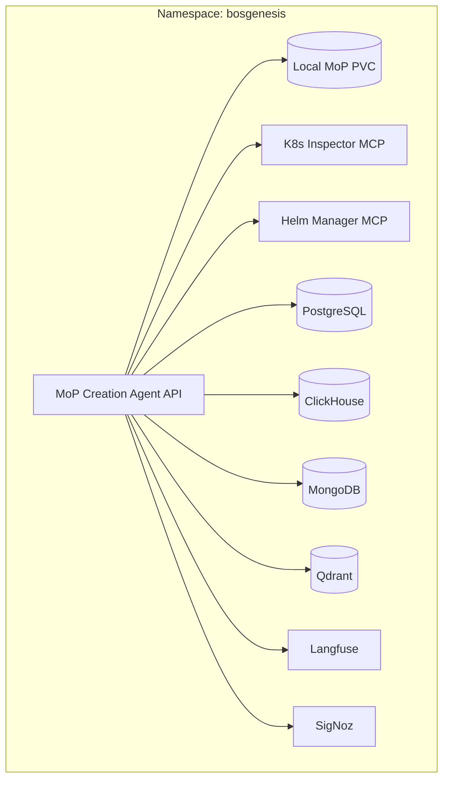
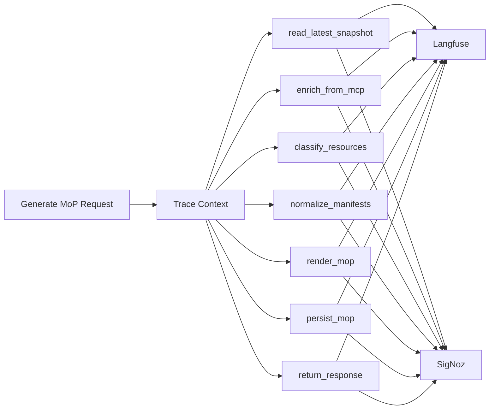

# BOS Genesis MoP Creation Agent - High Level Design

**Document status:** Initial scaffold  
**Agent name:** `bosgenesis-mop-creation-agent`  
**Primary mode:** On-demand only  
**Default source namespace:** `bosgenesis` from configuration  
**Target namespace:** Provided at runtime  
**Primary purpose:** Generate a human-executable Method of Procedure (MoP) and an LLM/agent-readable installation guide that can recreate or mimic BOS Genesis namespace resources into a target namespace using copyable commands and structured autonomous-execution instructions.

The agent is not an executor. It creates a safe, line-by-line MoP with commands, expected outputs, validation checkpoints, rollback notes, and execution log sections. It also creates an agent-readable Markdown guide for autonomous execution by another LLM/agent. It uses the latest inventory captured by the Analytical MoP ETL Agent and enriches it, when needed, through the existing Helm MCP and Kubernetes Inspector MCP.

The agent is non-deterministic by design. In Codex-integrated MCP mode, Codex can drive iterative reasoning and call the agent repeatedly to refine output. In standalone REST mode, the agent uses LangChain, GPT-4.1 mini or configured equivalent, and LangMem-backed memory to reason about ambiguous next steps.

## 1. High-Level Architecture

## 2. Responsibility Split

| Layer | Responsibility |
|---|---|
| API Layer | Accept on-demand generation requests and return file metadata/content. |
| MCP Layer | Expose on-demand Codex tools for generation, refinement, retrieval, and configuration inspection. |
| Orchestrator | Coordinate snapshot read, MCP enrichment, classification, normalization, rendering, persistence, tracing, and response shaping. |
| Snapshot Reader | Read latest Analytical MoP ETL Agent data from PostgreSQL and ClickHouse. |
| K8s MCP Client | Validate live Kubernetes resource state using the existing K8s Inspector MCP. |
| Helm MCP Client | Validate Helm releases, values, manifests, and history using the existing Helm MCP. |
| Resource Classifier | Split resources into Helm-managed, raw Kubernetes, excluded, and warning-only categories. |
| Manifest Normalizer | Remove runtime metadata, redact sensitive fields, and rewrite namespace references for the target namespace. |
| Reasoning Layer | Use deterministic rules first, then LLM reasoning for ambiguous installation order, missing public repo/chart details, values reconstruction, unknowns, and application-mode metadata guidance. |
| MoP and Guide Renderer | Generate final human MoP and agent-readable Markdown guide. |
| Persistence Layer | Save to local file, MongoDB, Qdrant, and metadata stores when enabled. |
| Observability Layer | Emit Langfuse and SigNoz traces, structured logs, and generation metrics. |
| Memory Layer | Save and retrieve generation patterns, previous MoPs, template decisions, short-term run state, episodic memory, and knowledge memory. |

## 3. End-to-End Flow

## 4. Runtime and Generation Modes

Runtime invocation:

- Codex-integrated MCP mode: Codex drives iterative generation, critique, and refinement.
- Standalone REST mode: REST trigger starts an autonomous LangChain flow using GPT-4.1 mini or a configured equivalent model.

Generation:

- `platform-only`: Kubernetes and Helm resources only.
- `application`: platform-only plus metadata-only schema/topology guidance for PostgreSQL, ClickHouse, Redis, MongoDB, Kafka, and similar approved targets.

## 5. Existing MCP Integration

### Kubernetes Inspector MCP

Used for namespace summary, pods, deployments, statefulsets, services, ingresses, PVCs, events, and optional bounded logs.

The MoP Creation Agent must use this MCP as the live Kubernetes validation boundary. It must not call raw `kubectl` while generating the MoP.

### Helm Manager MCP

Used for release list, release status, release history, values, manifests, chart details, and optional template preview.

The MoP Creation Agent must use this MCP as the Helm validation boundary. It must not call raw `helm` while generating the MoP.

### Analytical MoP ETL Agent

The latest ETL snapshot is the preferred starting point for inventory. MCP enrichment should be used to validate, fill gaps, or resolve ambiguity when snapshot data is incomplete or stale.

## 6. Resource Categorization

## 7. Deployment View

## 8. Data Stores

| Store | Purpose |
|---|---|
| Local file storage | Required output MoP file. |
| PostgreSQL | Read ETL latest snapshot and store request metadata when enabled. |
| ClickHouse | Read analytical inventory and write generation metrics when enabled. |
| MongoDB | Store full MoP document and raw generation trace. |
| Qdrant | Store MoP chunks for future retrieval and analytics. |
| Redis | Optional short-lived cache and idempotency lock. |
| pgvector | Optional semantic search alternative. |
| LangMem | Optional memory extraction/update around MoP patterns. |
| Letta | Future disabled adapter and future memory-layer option. |

## 9. Observability Model

## 10. Safety Boundaries

- The agent generates procedures; it does not execute them.
- Source namespace defaults to `bosgenesis` and must come from configuration.
- Target namespace is supplied at runtime and appears in generated commands and normalized manifests.
- v1 is single-namespace, namespace-only, Kubernetes/Helm based, and public-repository only.
- Secret values must never be copied into generated MoPs. Secret creation steps must use placeholders or references to pre-existing secret material.
- Runtime metadata, status fields, UIDs, resource versions, managed fields, pod names, and other non-recreatable state must be removed from generated manifests.
- Excluded or unsafe resources must be documented as manual notes rather than converted into executable commands.
- Agent-readable guides must not contain production data and must distinguish observed facts from inferred guidance.
