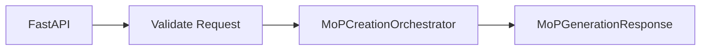
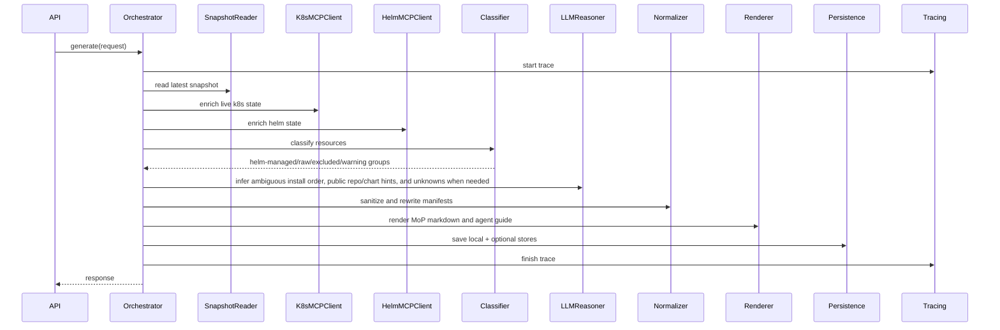
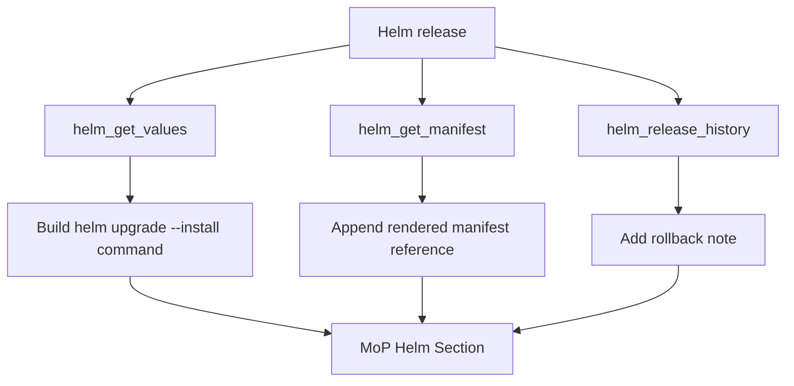
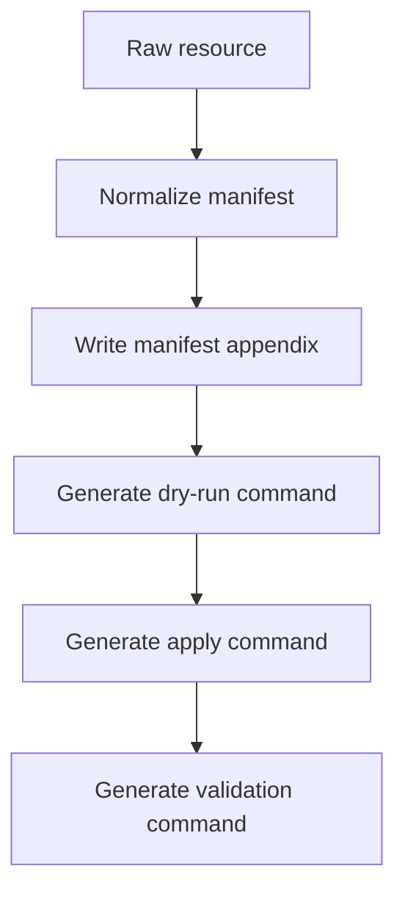

# BOS Genesis MoP Creation Agent - Low Level Design

**Document status:** Initial scaffold  
**Agent name:** `bosgenesis-mop-creation-agent`  
**Primary mode:** On-demand only  
**Default source namespace:** `bosgenesis` from configuration  
**Target namespace:** Provided at runtime  
**Primary purpose:** Generate a human-executable Method of Procedure (MoP) and an LLM/agent-readable installation guide that can recreate or mimic BOS Genesis namespace resources into a target namespace using copyable commands and structured autonomous-execution instructions.

The agent is not an executor. It creates a safe, line-by-line MoP with commands, expected outputs, validation checkpoints, rollback notes, and execution log sections. It also creates an LLM/agent-readable Markdown guide. It uses the latest inventory captured by the Analytical MoP ETL Agent and enriches it, when needed, through the existing Helm MCP and Kubernetes Inspector MCP.

The agent may use LLM reasoning when deterministic evidence is insufficient. Standalone mode uses LangChain, GPT-4.1 mini or configured equivalent, and LangMem-backed short-term, episodic, and knowledge memory.

## 1. Suggested Project Structure

The future implementation should preserve the spec-driven repository shape while adding source modules under `src/bosgenesis_mop_creation_agent/`.

```text
bosgenesis-mop-creation-agent/
  README.md
  pyproject.toml
  Dockerfile
  .env.example
  src/
    bosgenesis_mop_creation_agent/
      api/
        app.py
        mcp.py
        routes.py
      entrypoints/
        main.py
        runtime.py
      config/
        settings.py
      models/
        requests.py
        responses.py
        snapshots.py
        artifacts.py
      core/
        orchestrator.py
      sources/
        postgres_snapshot_reader.py
        clickhouse_snapshot_reader.py
        snapshot_models.py
      mcp_clients/
        base.py
        k8s_inspector_client.py
        helm_manager_client.py
        data_ingestion_client.py
      classification/
        resource_classifier.py
        helm_detector.py
        safety_classifier.py
      rendering/
        mop_template.py
        mop_renderer.py
        agent_guide_renderer.py
        command_builder.py
        manifest_normalizer.py
        markdown_writer.py
      persistence/
        local_storage.py
        mongodb_store.py
        qdrant_indexer.py
        postgres_metadata_store.py
        clickhouse_metrics_store.py
      memory/
        memory_router.py
        redis_cache.py
        pgvector_adapter.py
        langmem_adapter.py
        letta_adapter_disabled.py
      reasoning/
        planner.py
        dependency_graph.py
        inference_labels.py
      llm/
        langchain_flow.py
        model_gateway.py
        prompt_contracts.py
      observability/
        langfuse_tracer.py
        signoz_otel.py
        trace_context.py
      security/
        redaction.py
        policy.py
      common/
        errors.py
        ids.py
        time.py
        logging.py
  config/
    settings.yaml
    mop_template.yaml
    resource_policy.yaml
  tests/
```

## 2. Main Modules

| Module | Responsibility |
|---|---|
| `api/app.py` | FastAPI application factory and middleware setup. |
| `api/routes.py` | REST endpoints for MoP generation, retrieval, and health. |
| `api/mcp.py` | MCP tools for Codex-driven generation, refinement, retrieval, and health. |
| `core/orchestrator.py` | Main MoP generation flow. |
| `sources/postgres_snapshot_reader.py` | Reads latest ETL snapshot from PostgreSQL. |
| `sources/clickhouse_snapshot_reader.py` | Reads latest analytical snapshot from ClickHouse. |
| `mcp_clients/k8s_inspector_client.py` | Calls K8s Inspector MCP tools for live validation/enrichment. |
| `mcp_clients/helm_manager_client.py` | Calls Helm MCP tools for release, values, manifest, history, and chart evidence. |
| `mcp_clients/data_ingestion_client.py` | Calls Data Ingestion Agent MCP when snapshot metadata is exposed through MCP. |
| `classification/resource_classifier.py` | Categorizes resources into Helm-managed, raw Kubernetes, excluded, and warning-only groups. |
| `classification/helm_detector.py` | Detects Helm ownership from labels, annotations, release records, and rendered manifests. |
| `classification/safety_classifier.py` | Applies resource safety policy before a command is generated. |
| `rendering/manifest_normalizer.py` | Cleans manifests, redacts sensitive fields, and rewrites namespace. |
| `rendering/command_builder.py` | Builds copyable Helm and Kubernetes command blocks. |
| `rendering/mop_renderer.py` | Generates the Markdown MoP. |
| `rendering/agent_guide_renderer.py` | Generates the LLM/agent-readable Markdown installation guide. |
| `persistence/local_storage.py` | Writes Markdown and generated snippets to PVC/local path. |
| `persistence/mongodb_store.py` | Stores full MoP document and generation trace when enabled. |
| `persistence/qdrant_indexer.py` | Indexes MoP chunks when enabled. |
| `persistence/postgres_metadata_store.py` | Stores run and artifact metadata when enabled. |
| `persistence/clickhouse_metrics_store.py` | Stores generation metrics when enabled. |
| `memory/memory_router.py` | Coordinates optional Redis, pgvector, LangMem, and future Letta memory backends. |
| `reasoning/planner.py` | Coordinates deterministic and LLM-assisted reasoning for install order, unknowns, and inference labels. |
| `llm/langchain_flow.py` | Runs standalone REST-triggered autonomous reasoning through LangChain. |
| `llm/model_gateway.py` | Encapsulates GPT-4.1 mini or configured equivalent model access. |
| `observability/langfuse_tracer.py` | Emits Langfuse traces for prompts, decisions, and generation phases. |
| `observability/signoz_otel.py` | Emits OpenTelemetry spans and metrics for SigNoz. |
| `security/redaction.py` | Redacts secrets and sensitive values before prompts, logs, storage, and artifacts. |

## 3. API Design



### REST endpoints

```text
POST /mop-creation/generate
GET  /mop-creation/{mop_id}
GET  /mop-creation/latest
GET  /health
GET  /config/effective
```

### MCP tools

```text
mop_creation_health
mop_creation_generate
mop_creation_refine
mop_creation_get
mop_creation_latest
mop_creation_effective_config
```

### Request model

```text
MoPGenerationRequest
- source_namespace: optional string, defaults to config source_namespace
- target_namespace: required string
- source_snapshot_id: optional string, default latest
- mode: enum, platform-only or application
- include_helm: bool
- include_raw_k8s: bool
- include_validation_steps: bool
- include_rollback_steps: bool
- include_application_schema: bool
- output_artifacts: list, default ["human_mop", "agent_guide"]
- return_content: bool
- caller: string
- correlation_id: optional string
```

### Response model

```text
MoPGenerationResponse
- mop_id: string
- run_id: string
- correlation_id: string
- source_namespace: string
- target_namespace: string
- status: string
- file_path: string
- agent_guide_file_path: string
- content: optional string
- agent_guide_content: optional string
- resource_count: integer
- helm_release_count: integer
- excluded_resource_count: integer
- warning_count: integer
- trace_ids: object
- warnings: list
- created_at: timestamp
```

## 4. Orchestrator Sequence



## 5. Manifest Normalization Rules

Remove fields:

```text
metadata.uid
metadata.resourceVersion
metadata.generation
metadata.creationTimestamp
metadata.managedFields
metadata.ownerReferences
status
```

Rewrite fields:

```text
metadata.namespace = target_namespace
```

Redact or placeholder fields:

```text
Secret data and stringData
secret-like environment values
inline credentials
tokens
passwords
private keys
connection strings with credentials
```

Exclude by default:

```text
Secret
ServiceAccount
Role
RoleBinding
ClusterRole
ClusterRoleBinding
Namespace
Node
PersistentVolume
CustomResourceDefinition
```

Secrets are documented as manual prerequisite placeholders. RBAC and cluster-scoped resources are excluded unless a future approved policy explicitly adds them.

## 6. Helm Recreation Logic



Generated command pattern:

```bash
helm upgrade --install <release-name> <chart-ref> \
  --namespace <target-namespace> \
  --create-namespace \
  -f values-<release-name>.yaml \
  --dry-run

helm upgrade --install <release-name> <chart-ref> \
  --namespace <target-namespace> \
  --create-namespace \
  -f values-<release-name>.yaml \
  --atomic \
  --timeout 10m
```

If the chart reference cannot be proven from Helm evidence, the MoP must mark the chart reference as inferred or unknown and require human confirmation.

## 7. Raw Kubernetes Recreation Logic



Command pattern:

```bash
kubectl apply -f generated/<kind>-<name>.yaml -n <target-namespace> --dry-run=server -o yaml
kubectl apply -f generated/<kind>-<name>.yaml -n <target-namespace>
```

Generated raw Kubernetes sections must include validation commands and a rollback note for each resource group when practical.

## 8. Application Mode Logic

Application mode extends platform-only generation with schema/topology metadata, not production data.

Supported initial targets:

- PostgreSQL schema definitions.
- ClickHouse schema definitions.
- MongoDB database and collection shape.
- Redis keyspace pattern summary.
- Kafka brokers and topics.

Application-mode collectors must use explicitly provided read-only credentials or approved MCP/data-ingestion boundaries. Schema values, records, messages, cache contents, and business data remain out of scope.

## 9. Agent-Readable Guide Logic

The agent-readable guide is generated alongside the human MoP. It must contain:

- structured metadata;
- execution phases;
- dependency graph;
- command blocks;
- validation checks;
- rollback hints;
- evidence references;
- inference labels and confidence;
- required human inputs.

The guide is intended for autonomous execution by another LLM/agent, but this agent still does not execute it.

## 10. Persistence Details

Local storage is always enabled:

```text
/data/mops/<file-name>.md
/data/mops/<file-name>.agent.md
/data/mops/<mop-id>/generated/*.yaml
/data/mops/<mop-id>/values/*.yaml
/data/mops/<mop-id>/evidence/*.json
```

MongoDB document shape:

```json
{
  "mop_id": "uuid",
  "run_id": "uuid",
  "correlation_id": "uuid",
  "source_namespace": "bosgenesis",
  "target_namespace": "target-ns",
  "mode": "platform-only",
  "content": "markdown",
  "created_at": "timestamp",
  "resource_count": 42,
  "helm_release_count": 5,
  "excluded_resource_count": 3,
  "trace_ids": {
    "langfuse": "trace",
    "signoz": "trace"
  }
}
```

Qdrant chunk metadata should include `mop_id`, `run_id`, section name, resource kind/name when applicable, source namespace, target namespace, and evidence references.

## 11. Error Handling

| Error | Behavior |
|---|---|
| PostgreSQL disabled/unavailable | Try ClickHouse, then MCP live enrichment if enabled. |
| ClickHouse disabled/unavailable | Continue with PostgreSQL. |
| Both snapshot stores unavailable | Return error unless live MCP fallback is enabled. |
| K8s MCP unavailable | Continue with stored snapshot and warning. |
| Helm MCP unavailable | Generate raw Kubernetes MoP and warn that Helm section is incomplete. |
| MongoDB unavailable | Continue; local file still returned. |
| Qdrant unavailable | Continue; local file still returned. |
| Redis unavailable | Continue without cache/idempotency lock if policy permits. |
| LangMem unavailable | Continue without memory enrichment. |
| External LLM unavailable in standalone mode | Return error unless deterministic-only fallback is explicitly allowed. |
| Langfuse/SigNoz unavailable | Continue with local structured logs. |
| Secret-like value detected in artifact | Fail validation and do not publish artifact. |

## 12. Observability and Audit

Every run must emit structured phase events:

```text
request_received
read_latest_snapshot
enrich_from_mcp
classify_resources
normalize_manifests
render_mop
persist_mop
validate_artifact
return_response
llm_reasoning_started
llm_reasoning_completed
agent_guide_rendered
```

Each event must carry `run_id`, `correlation_id`, source namespace, target namespace, mode, caller, phase, status, latency, and error details when present.

## 13. Tests

| Test | Expected |
|---|---|
| Generate MoP from sample snapshot | Markdown contains all required sections. |
| Target namespace rewrite | All generated manifests use target namespace. |
| Secret exclusion | Secrets and secret-like values are excluded or replaced with placeholders. |
| Helm release section | Helm commands are generated when release data exists. |
| Raw Kubernetes section | Supported non-Helm resources produce dry-run, apply, validate, and rollback notes. |
| Unsupported resource exclusion | Unsafe resources appear as manual notes, not executable commands. |
| Optional store disabled | Agent succeeds with local file only. |
| Trace disabled | Agent succeeds without Langfuse/SigNoz. |
| Return content true | API returns Markdown content. |
| MCP unavailable fallback | Stored snapshot path returns warning instead of crashing when allowed. |
| Application mode metadata only | Schema output contains no records, messages, or cache values. |
| Agent-readable guide generated | `.agent.md` guide contains metadata, phases, dependency graph, validation, rollback, evidence, and unknowns. |
| Standalone LLM path | LangChain/model gateway path records reasoning trace and handles model failure according to policy. |
