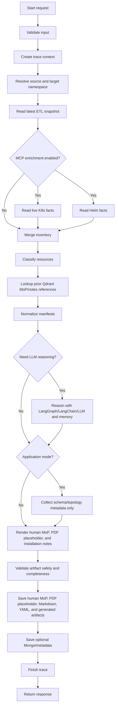
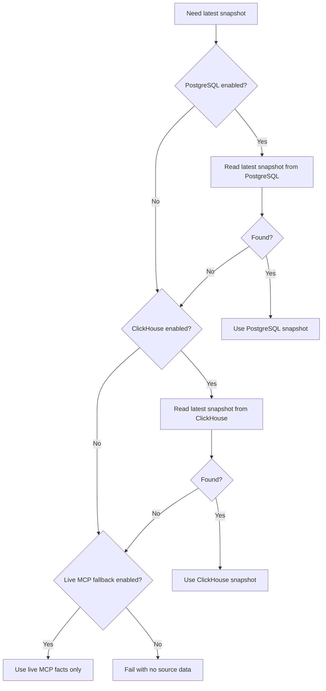
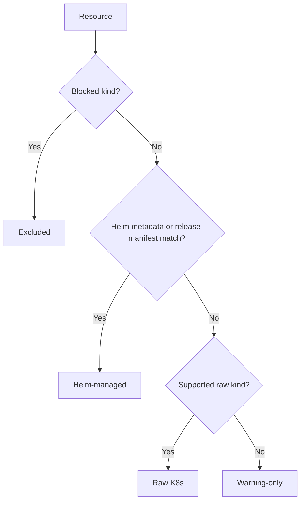
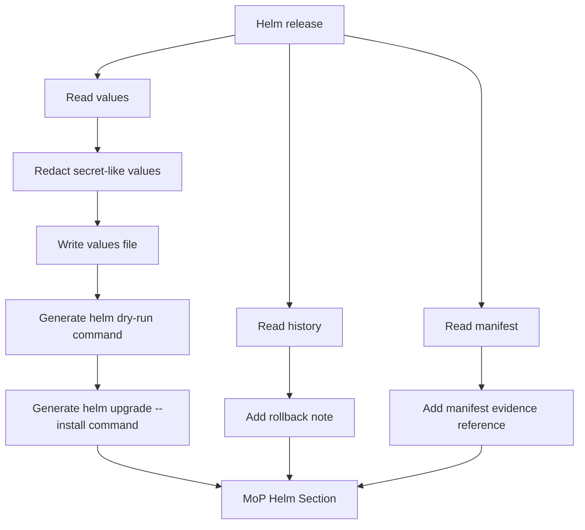
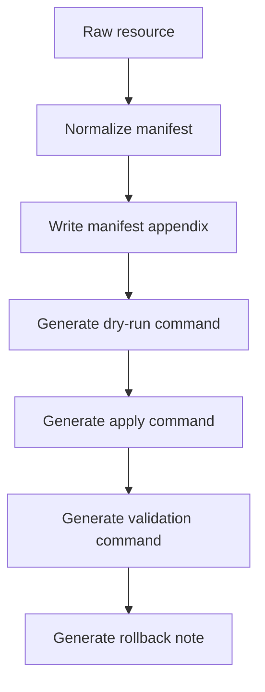
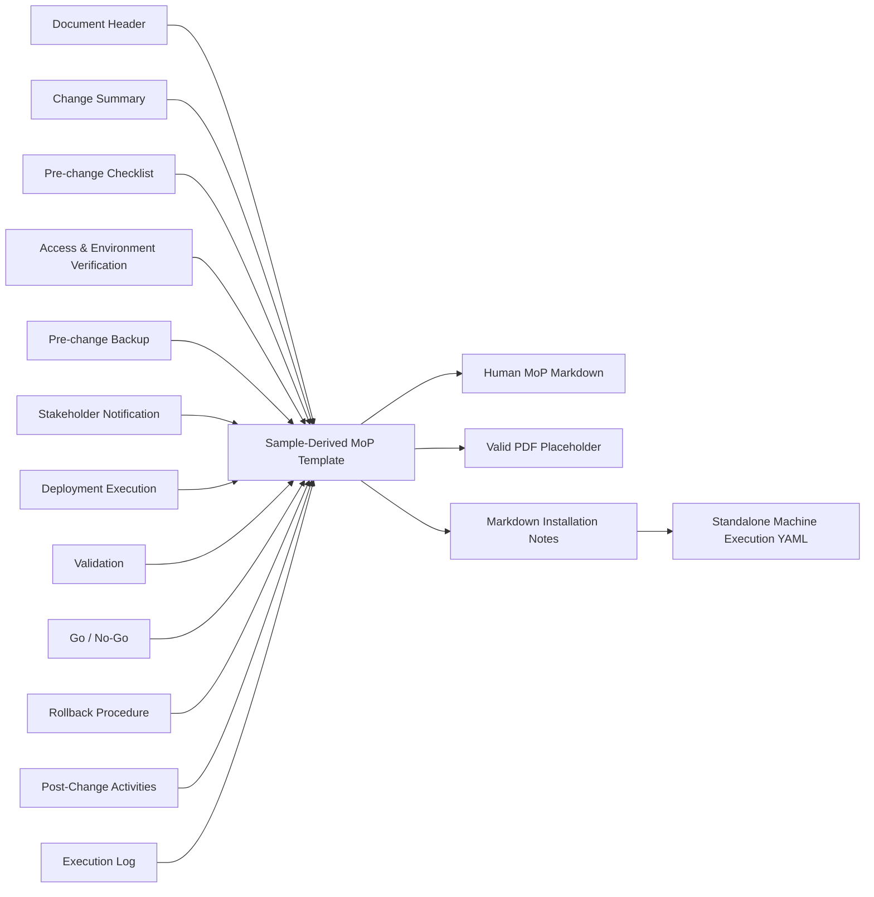
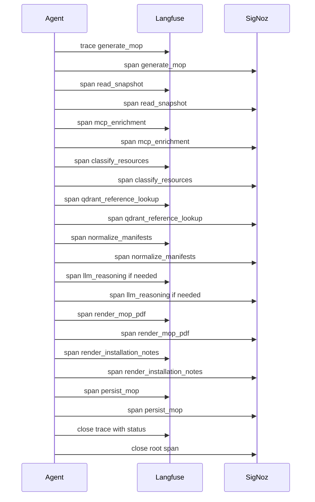

# BOS Genesis MoP Creation Agent - Algorithm Design

**Document status:** Initial scaffold  
**Agent name:** `bosgenesis-mop-creation-agent`  
**Primary mode:** On-demand only  
**Default source namespace:** `bosgenesis` from configuration  
**Target namespace:** Provided at runtime  
**Primary purpose:** Generate sample-format human Method of Procedure (MoP) artifacts and LLM/agent-readable Markdown installation notes that can recreate or mimic BOS Genesis namespace resources into a target namespace using copyable commands and structured autonomous-execution instructions.

The agent is not an executor. It creates safe, line-by-line human MoP content from the approved sample-derived template and writes a valid PDF placeholder until production PDF rendering is implemented. It also creates LLM/agent-readable Markdown installation notes and standalone machine execution YAML. It uses the latest inventory captured by the Analytical MoP ETL Agent and enriches it, when needed, through the existing Helm MCP and Kubernetes Inspector MCP.

The reasoning loop is non-deterministic when needed. Deterministic evidence handling runs first; LangGraph coordinates standalone workflow state and repair loops, while LangChain and the configured LLM profile are used where useful to infer ambiguous next steps, dependency order, unknowns, and application-mode guidance.

## 1. Core Algorithm



## 2. Detailed Pseudocode

```text
function generate_mop(request):
    validate target_namespace
    validate mode in ["platform-only", "application"]
    validate v1 scope: single namespace, namespace-only, Kubernetes/Helm, public repos only

    source_namespace = request.source_namespace or config.source_namespace
    mop_id = uuid()
    run_id = uuid()
    correlation_id = request.correlation_id or uuid()

    start langfuse trace if enabled
    start otel root span if enabled
    emit audit event request_received

    snapshot = read_latest_snapshot(source_namespace)

    if k8s_mcp.enabled:
        k8s_live = read_k8s_live_state(source_namespace)
    else:
        k8s_live = empty with warning

    if helm_mcp.enabled and request.include_helm:
        helm_live = read_helm_live_state(source_namespace)
    else:
        helm_live = empty with warning

    inventory = merge(snapshot, k8s_live, helm_live)

    if inventory is empty and live_mcp_fallback is disabled:
        fail with clear no-source-data error

    classified = classify_inventory(inventory)
    prior_references = lookup_qdrant_references(classified, inventory)
    reasoning_plan = build_deterministic_reasoning_plan(classified)

    if reasoning_plan.has_ambiguity and standalone_llm_enabled:
        reasoning_plan = refine_with_langgraph_llm(
            reasoning_plan,
            redacted_evidence,
            prior_references,
            memory_context
        )

    reconstruction_plan = empty
    normalized_manifests = []
    excluded = []
    warnings = []

    for each raw resource in classified.raw_k8s:
        if safe_to_recreate(resource):
            normalized = normalize(resource, target_namespace)
            remove runtime metadata, status, cluster assigned service/PVC fields
            write generated/<kind>-<name>.yaml
            normalized_manifests.append(normalized)
        else:
            excluded.append(resource)

    for each helm release:
        extract values evidence
        redact secret-like keys
        write values/values-<release>.yaml

    helm_steps = build_helm_steps(inventory.helm_releases, target_namespace)
    k8s_steps = build_k8s_apply_steps(normalized_manifests, target_namespace)
    validation_steps = build_validation_steps(inventory, target_namespace)
    rollback_steps = build_rollback_steps(inventory, target_namespace)
    reconstruction_plan = write platform-only artifact bundle

    if llm.repair_suggestions_enabled and reconstruction_plan.has_gaps:
        llm_suggestions = request_suggestion_only_repairs(
            redacted_issue_context,
            minimum_confidence,
            authority_order="Observed evidence > deterministic normalization > LLM suggestion > human fill-in"
        )
        keep suggestions as human-review guidance only
        do not mutate executable YAML from LLM output

    if request.mode == "application" and request.include_application_schema:
        schema_metadata = collect_application_schema_metadata(request)
    else:
        schema_metadata = empty

    mop_document = render_sample_format_mop_model(
        request,
        inventory,
        helm_steps,
        k8s_steps,
        schema_metadata,
        validation_steps,
        rollback_steps,
        excluded,
        warnings
    )

    human_mop_markdown = render_human_mop_markdown(mop_document)
    mop_pdf_placeholder = render_mop_pdf_placeholder(mop_document)

    installation_notes_markdown = render_installation_notes(
        request,
        inventory,
        reasoning_plan,
        helm_steps,
        k8s_steps,
        schema_metadata,
        validation_steps,
        rollback_steps,
        excluded,
        warnings
    )

    machine_execution_plan_yaml = render_machine_execution_plan_yaml(
        reconstruction_plan,
        validation_steps,
        rollback_steps,
        excluded,
        warnings
    )

    validate_no_secret_values(mop_document)
    validate_no_secret_values(human_mop_markdown)
    validate_no_secret_values(installation_notes_markdown)
    validate_no_secret_values(machine_execution_plan_yaml)
    validate_sample_mop_sections(mop_document)
    validate_installation_notes_contract(installation_notes_markdown)
    validate_machine_execution_plan_contract(machine_execution_plan_yaml)
    validate_target_namespace_rewrite(normalized_manifests, target_namespace)

    human_mop_path = write_human_mop_file(mop_id, human_mop_markdown)
    file_path = write_pdf_placeholder_file(mop_id, mop_pdf_placeholder)
    installation_notes_path = write_installation_notes_file(mop_id, installation_notes_markdown)
    machine_execution_plan_path = write_machine_execution_plan_file(mop_id, machine_execution_plan_yaml)
    artifact_manifest_path = write_artifact_manifest(mop_id)
    save optional stores if enabled

    finish traces
    return response
```

## 3. Snapshot Selection Algorithm



Snapshot selection preference:

1. PostgreSQL latest ETL snapshot.
2. ClickHouse analytical inventory.
3. Live MCP-only fallback when explicitly enabled.
4. Fail with a clear request for ETL refresh or dependency repair.

## 4. MCP Enrichment Algorithm

```text
function enrich_from_mcp(source_namespace, include_helm):
    k8s_facts = {}
    helm_facts = {}

    if k8s_mcp.enabled:
        k8s_facts.namespace_summary = k8s_namespace_summary(source_namespace)
        k8s_facts.deployments = k8s_list_deployments(source_namespace)
        k8s_facts.statefulsets = k8s_list_statefulsets(source_namespace)
        k8s_facts.services = k8s_list_services(source_namespace)
        k8s_facts.ingresses = k8s_list_ingresses(source_namespace)
        k8s_facts.pvcs = k8s_list_pvcs(source_namespace)
        k8s_facts.events = k8s_list_events(source_namespace)

    if helm_mcp.enabled and include_helm:
        helm_facts.releases = helm_list_releases(source_namespace)
        for each release:
            helm_facts.status[release] = helm_release_status(release)
            helm_facts.history[release] = helm_release_history(release)
            helm_facts.values[release] = helm_get_values(release)
            helm_facts.manifest[release] = helm_get_manifest(release)

    return k8s_facts, helm_facts
```

The agent uses MCP enrichment only for reading and validation. It must not invoke Kubernetes or Helm mutation tools during MoP generation.

## 5. Resource Classification Algorithm

```text
for each resource:
    if resource.kind in blocked_kinds:
        category = excluded
    else if has labels app.kubernetes.io/managed-by=Helm or annotations meta.helm.sh/*:
        category = helm_managed
    else if resource appears in Helm rendered manifest:
        category = helm_managed
    else if resource.kind in supported_raw_k8s_kinds:
        category = raw_k8s
    else:
        category = warning_only
```



## 6. Qdrant Prior Reference Lookup Algorithm

```text
function lookup_qdrant_references(classified, inventory):
    if qdrant retrieval is disabled:
        return empty references with status disabled

    component_queries = build component queries from:
        Helm release names and chart refs
        app.kubernetes.io labels and Helm annotations
        workload names and container image names
        service names and ingress hosts
        application-mode database/cache/stream component names

    references = []
    for each query:
        matches = qdrant.search(collection, query, top_k, min_score)
        for each match:
            if match has component metadata, artifact source, score, and citation:
                redacted = redact(match.text)
                references.append(redacted match)

    if no references:
        emit warning qdrant_reference_not_found

    return references
```

Qdrant references are prior installation knowledge only. They can inform reasoning and template wording, but they must not override current namespace evidence. The agent never writes to Qdrant; vectorization and ingestion are owned by a separate agent.

## 7. Manifest Normalization Algorithm

```text
function normalize(resource, target_namespace):
    clone resource
    remove metadata.uid
    remove metadata.resourceVersion
    remove metadata.generation
    remove metadata.creationTimestamp
    remove metadata.managedFields
    remove metadata.ownerReferences
    remove status
    set metadata.namespace = target_namespace
    remove noisy annotations if configured
    redact secret-like values if present
    validate no blocked fields exist
    return normalized manifest
```

Blocked kinds are excluded before normalization:

```text
Secret
ServiceAccount
Role
RoleBinding
ClusterRole
ClusterRoleBinding
Namespace
Node
PersistentVolume
CustomResourceDefinition
```

## 8. Helm Recreation Algorithm



Generated command pattern:

```bash
helm upgrade --install <release-name> <chart-ref> \
  --namespace <target-namespace> \
  --create-namespace \
  -f values-<release-name>.yaml \
  --dry-run

helm upgrade --install <release-name> <chart-ref> \
  --namespace <target-namespace> \
  --create-namespace \
  -f values-<release-name>.yaml \
  --atomic \
  --timeout 10m
```

If the chart reference cannot be proven from release metadata, repository metadata, or history, the generated MoP must mark it as inferred or unknown and require human confirmation.

## 9. Raw Kubernetes Recreation Algorithm



Command pattern:

```bash
kubectl apply -f generated/<kind>-<name>.yaml -n <target-namespace> --dry-run=server -o yaml
kubectl apply -f generated/<kind>-<name>.yaml -n <target-namespace>
```

## 10. Application Mode Algorithm

Application mode runs after platform inventory is merged and classified.

```text
if mode == "application":
    discover supported metadata collectors
    for each enabled target:
        validate read-only credentials or approved MCP boundary
        collect schema/topology metadata only
        redact credentials and sample values
        render schema recreation section
        add validation checks
```

Initial supported targets:

- PostgreSQL schema definitions.
- ClickHouse schema definitions.
- MongoDB database and collection shape.
- Redis keyspace pattern summary.
- Kafka brokers and topics.

Application mode must not copy table rows, MongoDB documents, Kafka messages, Redis values, uploaded files, or any production data.

## 11. Non-Deterministic Reasoning Algorithm

```text
function refine_with_langgraph_llm(plan, redacted_evidence, prior_references, memory_context):
    initialize LangGraph state with plan, evidence, prior references, and memory context
    run graph nodes for plan, critique, repair, and final validation
    prepare prompt with observed evidence only
    include accepted Qdrant references as cited, non-authoritative prior guidance
    include public-repository-only constraint
    include namespace-only constraint
    include no-secret/no-data constraint
    ask model for ordered steps, inferred gaps, confidence, and unknowns
    validate model output against policy
    label inferred steps
    store non-secret reasoning summary in LangMem
    return refined plan
```

LLM reasoning must never receive secret values or production data. Every prompt, response, inference, and validation result must be traced in Langfuse and correlated with SigNoz/OpenTelemetry spans.

## 12. Human MoP and Installation Notes Rendering Algorithm



The renderer must include:

- source and target namespace details;
- generation mode;
- evidence timestamp or snapshot ID;
- assumptions and unknowns;
- executable command sections;
- validation checkpoints;
- rollback guidance;
- excluded and manual resources;
- evidence appendix;
- cited Qdrant prior references when used;
- execution log section for human operators.
- structured execution phases, dependency graph, expected outcomes, inference labels, required human inputs, and machine execution plan for the Markdown installation notes.

The current PDF output is a placeholder artifact for API/artifact contract stability. Production-quality PDF layout is deferred to the PDF renderer phase.

## 13. Generated Command Ordering

1. Confirm source and target contexts.
2. Confirm target namespace exists or create it manually.
3. Create or confirm required secrets from placeholders.
4. Create ConfigMaps first.
5. Create PVCs if allowed and storage class exists.
6. Install or upgrade Helm releases.
7. Apply raw services.
8. Apply deployments, statefulsets, daemonsets, jobs, and cronjobs.
9. Apply ingresses last.
10. Run application-mode schema recreation steps when selected.
11. Validate pods, deployments, services, ingress, Helm release status, and application schemas.

## 14. Go/No-Go Logic

| Checkpoint | Expected | Failed action |
|---|---|---|
| Source snapshot found | Latest snapshot available | Stop and request ETL refresh or enable MCP fallback. |
| Target namespace available | Namespace exists or is intentionally created | Stop. |
| Secret placeholders resolved | Operator has provided required secret material | Stop. |
| Helm dry-run success | No template/render error | Fix values/chart issue. |
| Kubectl dry-run success | Server accepts manifest | Fix manifest. |
| Rollout health | Desired replicas ready | Stop and investigate. |
| Service endpoints | Endpoints populated | Stop and investigate. |
| Ingress created | Host/path visible | Validate ingress controller. |
| Application schema validation | Expected schemas/topics exist | Stop and investigate metadata recreation. |

## 15. Rollback Generation Algorithm

Rollback is written as human guidance, not executed by the agent.

For Helm releases:

```bash
helm uninstall <release-name> -n <target-namespace>
```

For raw manifests:

```bash
kubectl delete -f generated/<manifest>.yaml -n <target-namespace>
```

For namespace-level cleanup only if the target namespace was newly created and approved:

```bash
kubectl delete namespace <target-namespace>
```

Application-mode rollback must describe schema/topic cleanup cautiously and should default to manual review.

## 16. Artifact Validation Algorithm

```text
function validate_artifact(mop_markdown, manifests, target_namespace):
    assert required sections exist
    assert no known secret values are present
    assert generated manifests do not contain blocked runtime fields
    assert generated manifests use target_namespace
    assert excluded resources are not emitted as executable apply commands
    assert unknown chart references are marked
    assert application mode contains metadata only
    assert human MoP content contains sample-derived required sections
    assert PDF placeholder is present until production PDF renderer is enabled
    assert installation notes contain machine_execution_plan, structured phases, and evidence references
    assert standalone machine_execution_plan.yaml exists and contains no YAML aliases
    assert Qdrant references are cited and do not appear as observed current-state facts
    assert all inferred steps are labeled
```

Validation failures for redaction, blocked resources, or production data leakage must fail the request before artifact publication.

## 16.1 Artifact Lifecycle Algorithm

```text
function preview_artifact(mop_id, relative_path):
    resolve path under configured artifact root and mop_id run directory
    reject traversal, absolute paths, disallowed extensions, or missing files
    return bounded preview with truncation metadata

function download_artifact(mop_id, relative_path):
    resolve path under configured artifact root and mop_id run directory
    reject traversal, absolute paths, disallowed extensions, or missing files
    stream full file without truncation

function archive_artifacts(mop_id, prefix):
    resolve prefix under configured artifact root and mop_id run directory
    reject traversal or non-directory prefixes
    create zip from allowed files only
    return archive stream

function delete_mop(mop_id):
    remove only the selected mop_id run directory under configured artifact root
    remove related in-memory run metadata
    return removed file, directory, and byte counts

function delete_all_mops(confirm):
    require confirm == true
    remove only run directories under configured artifact root
    return removed file, directory, and byte counts
```

Preview is intentionally bounded for quick inspection. Download and archive endpoints provide full artifact retrieval without requiring shell access to the pod or PVC.

## 17. Observability Algorithm



Every phase event must carry `run_id`, `correlation_id`, source namespace, target namespace, generation mode, caller, phase, status, latency, and error details when present.

## 18. Failure Algorithm

```text
if no inventory data:
    fail request with clear error
else if artifact validation finds secret leakage:
    fail request and do not persist publishable artifact
else if local storage fails:
    fail request because local file is mandatory
else if standalone mode requires LLM and model is unavailable:
    fail request unless deterministic-only fallback is enabled
else if qdrant retrieval fails:
    continue and add warning
else if optional store fails:
    continue and add warning
else if observability fails:
    continue and write local log warning
else:
    return success with warnings if any
```

## 19. Future Enhancements

- Letta memory adapter enablement.
- Human approval workflow before exposing final MoP.
- Automatic MoP quality score.
- Diff against target namespace before generating apply commands.
- Policy-as-code validation using OPA.
- MoP simulation mode using dry-run results from approved MCP servers.
- Multi-namespace reconstruction.
- Cluster-admin add-only scope.
- Custom/private repository support.
- Docker image reconstruction hints.
- Letta-backed memory layer activation.
